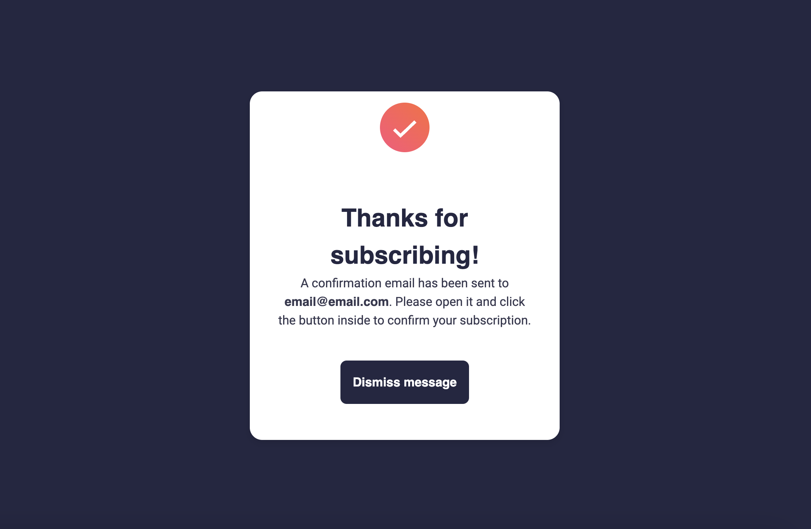
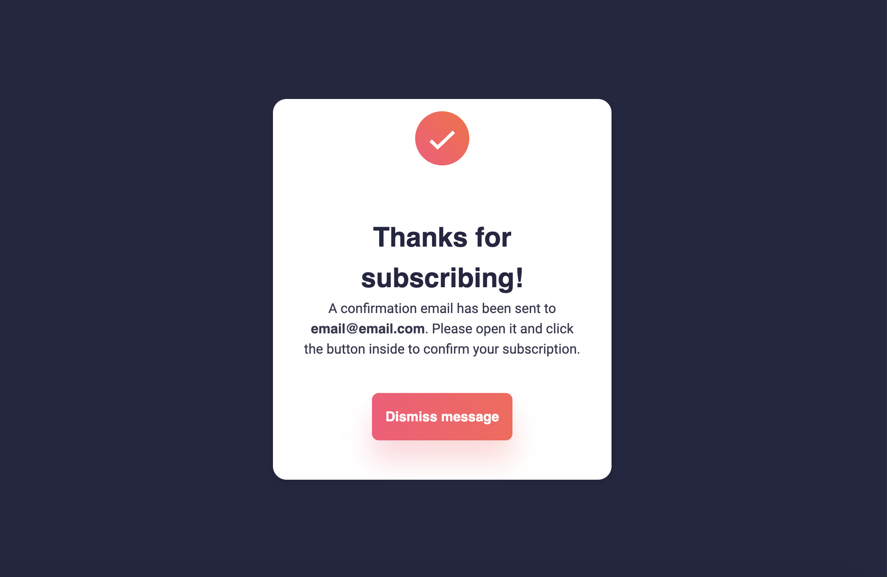

## Overview
This is my solution to the "Newsletter sign-up form with a success message" challenge from [Front](https://www.frontendmentor.io/)

Users will be able to:

- Add their email and submit the form
- See a success message with their email after successfully submitting the form
- See form validation messages if:
  - The field is left empty
  - The email address is not formatted correctly
- See hover and focus states for all interactive elements on the page

### Screenshot

### Built with

- HTML5 - Structure and content of the web page
- CSS - Styling and layout using custom properties (CSS variables), media queries, and font face definitions
- JavaScript - For dynamic behavior, such as storing user input (email) in localStorage
- Roboto Font - Google font used for typography
